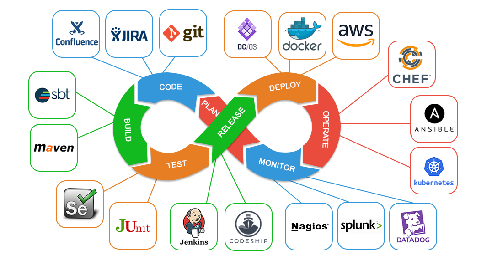

# DevOps Projects



Welcome to my DevOps Projects Repository! This repository is a showcase of various DevOps projects I've worked on, highlighting my experience and skills in automation, infrastructure as code, CI/CD pipelines, and cloud technologies.

## Table of Contents
- [Introduction](#introduction)
- [Projects](#projects)
  - [Project 1: Implementing CI/CD, Docker, Kubernetes, Argo CD, and Selenium for Testing in a Laravel Application Deployment](#project-1-Implementing-CI-CD)
  - [Project 2: Infrastructure as Code with Terraform](#project-2-infrastructure-as-code-with-terraform)
  - [Project 3: Monitoring and Logging with Prometheus and Grafana](#project-3-monitoring-and-logging-with-prometheus-and-grafana)
- [Skills and Technologies](#skills-and-technologies)
- [Getting Started](#getting-started)
- [Contact](#contact)

## Introduction
In this repository, you'll find a collection of my DevOps projects, each showcasing different aspects of DevOps practices and technologies. These projects demonstrate my ability to design, implement, and manage complex systems and workflows, focusing on automation, scalability, and reliability.

## Projects

### Project 1: Implementing CI/CD, Docker, Kubernetes, Argo CD, and Selenium for Testing in a Laravel Application Deployment

**Description:** This project sets up a CI/CD pipeline for a Laravel application, utilizing Docker for containerization, Kubernetes for orchestration, Argo CD for GitOps-based delivery.

**Technologies:** Jenkins, Docker, Kubernetes, Argo CD

**Key Features:**
- Dockerized application for consistent environments.
- Kubernetes for scalable and reliable deployments.
- Argo CD for GitOps-driven continuous delivery.

[Link to Project: Implementing CI/CD, Docker, Kubernetes, Argo CD, and Selenium for Testing in a Laravel Application Deployment](#)

## Skills and Technologies
- **CI/CD:** Jenkins
- **Containerization:** Docker, Kubernetes
- **Cloud Providers:** AWS, Azure
- **Configuration Management:** Ansible
- **Monitoring & Logging:** Prometheus, Grafana, ELK Stack
- **Testing:** Selenium

## Getting Started
To explore these projects, you can clone the repository and navigate to the individual project directories. Each project folder contains a README with detailed setup instructions and prerequisites.

```bash
git clone https://github.com/ELemenoppee/devops-projects.git
cd devops-projects
```

## Contact
Feel free to reach out if you have any questions or suggestions. 