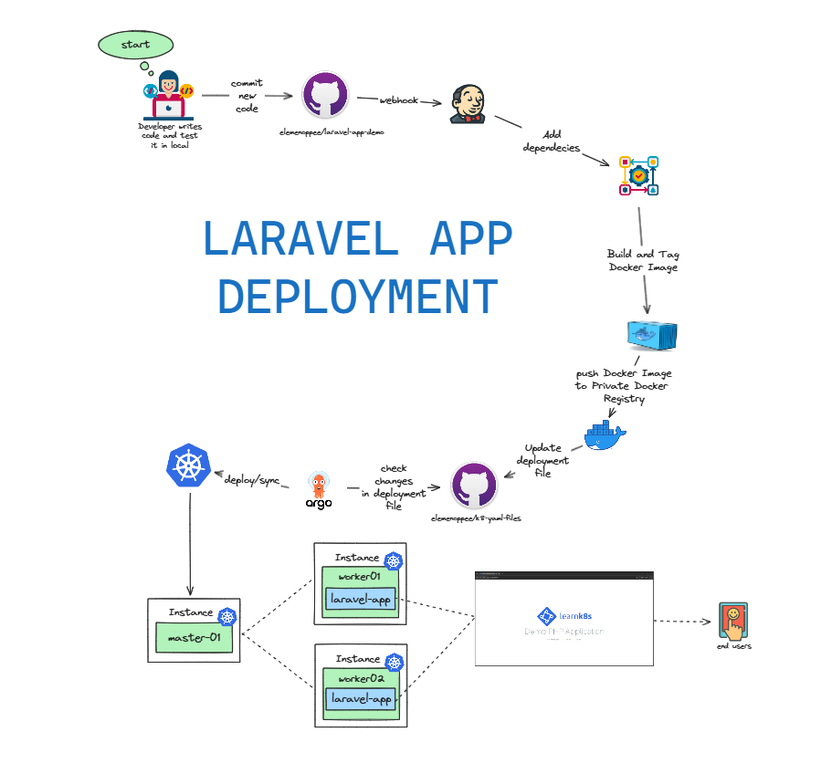
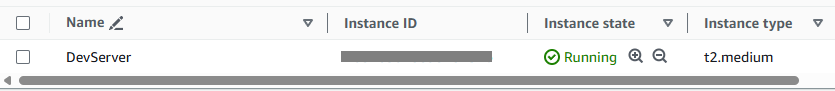
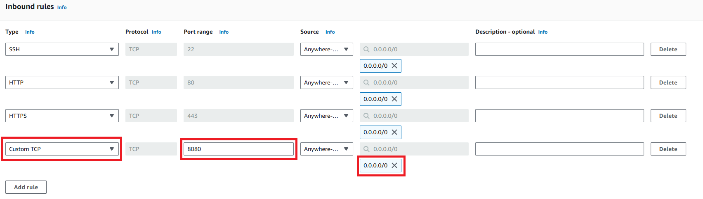
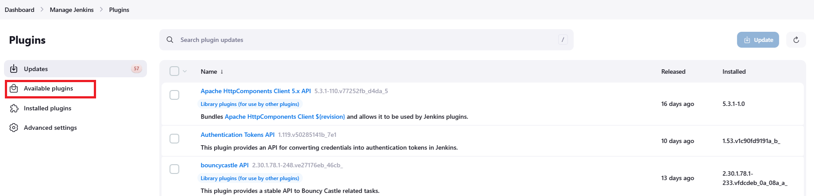
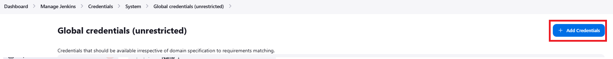
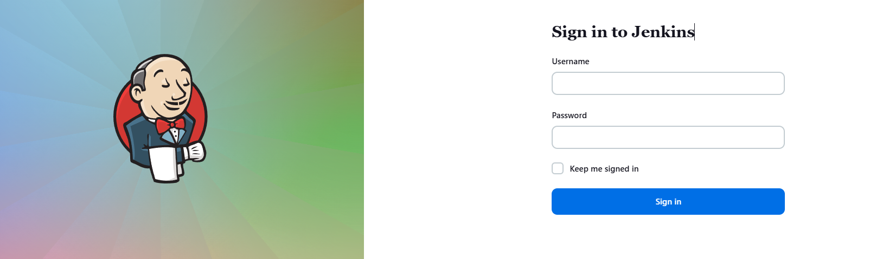
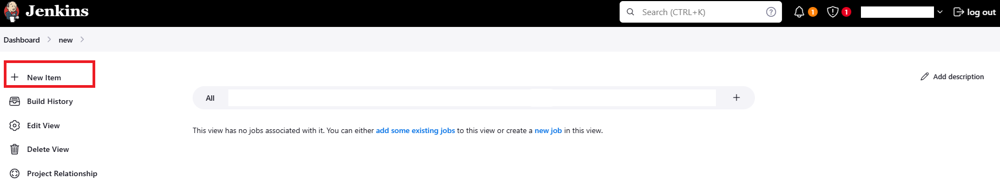
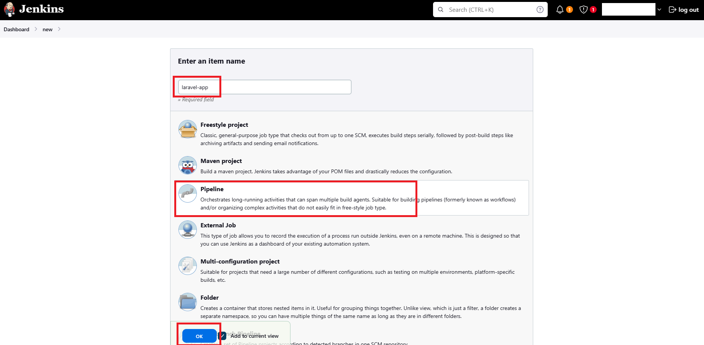
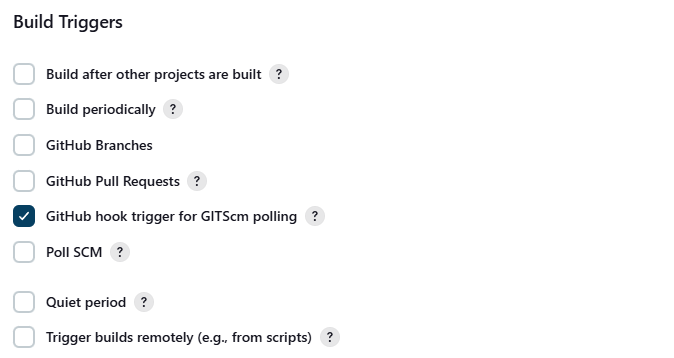

# 🧪 Implementing CI/CD, Docker, Kubernetes, Argo CD, and Selenium for Testing in a Laravel Application Deployment



## Introduction

This repository showcases a CI/CD pipeline designed to streamline the development, testing, and deployment processes for a Laravel application. The diagram below illustrates the complete workflow from code commit to deployment

## Workflow Steps

**1** — Developer Workflow

+ A developer writes code and tests it locally.
+ Once satisfied, the developer commits the new code to the elemenoppee/laravel-app-demo repository on GitHub.

**2** — Continuous Integration (CI)

+ A webhook triggers Jenkins to start the CI process.
+ Jenkins pulls the code and adds necessary dependencies.
+ Jenkins then builds and tags a Docker Images/image for the application.
+ The newly built Docker Images/image is pushed to a private Docker registry.

**3** — Updating Deployment Configuration

+ The deployment file in the elemenoppee/k8s-yaml-files repository is updated to reference the new Docker Images/image.

**4** — Continuous Deployment (CD)

+ Argo CD checks for changes in the deployment file.
+ If changes are detected, Argo CD synchronizes the Kubernetes cluster with the updated deployment configuration.
+ The application is deployed across the Kubernetes cluster, which includes master01, worker01, and worker02 instances.

**5** — Deployment to Production

+ Once testing is successful, the application is accessible to end-users via the Laravel Application platform.

## Key Components

+ **`Jenkins`** — Automates the CI process by building, testing, and pushing Docker Images/images.
+ **`Docker`** — Containerizes the application for consistent deployment across environments.ocess, ensuring the Kubernetes cluster is in sync with the latest deployment 
+ **`Argo CD`** — Manages the CD prconfiguration.
+ **`Kubernetes`** — Orchestrates the deployment, scaling, and management of containerized applications.

## Repositories

+ **Main Application Code:** https://github.com/ELemenoppee/laravel-app-demo
+ **Deployment Configuration:** https://github.com/ELemenoppee/kubernetes-yaml-files

##  Setting Up Required Prerequisites:-

### **A:** — Jenkins, Docker

Jenkins and Docker Installation: https://github.com/ELemenoppee/devops-config-install/blob/main/jenkins/jenkins-docker-install.md

### **B:** — Private Docker Registry

Private Docker Registry Configuration: https://github.com/ELemenoppee/devops-config-install/blob/main/docker/private-docker-registry.md

### **C:** — Kubernetes Deployment

Kubernetes Deployment: https://github.com/ELemenoppee/devops-config-install/blob/main/kubernetes/k8-install.md

### **D:** — Argo CD

Argo CD Installation: https://github.com/ELemenoppee/devops-config-install/blob/main/argocd/argocd-install.md

### **E:** — EC2 Instance

Create AWS EC2 Instance: https://github.com/ELemenoppee/aws-configs/blob/main/create-ec2-instance.md

### **F:** — Github Webhooks

Setting Up GitHub Webhooks with Jenkins: https://github.com/ELemenoppee/devops-config-install/blob/main/jenkins/jenkins-github-webhook-settings.md

##  Steps:-

### **Step 1** — Launch an EC2 Instance

Launch an AWS T2 Medium Instance. Use the Images/image as Ubuntu. You can create a new key pair or use an existing one. Enable HTTP and HTTPS settings in the Security Group.



### **Step 2** — Install Jenkins, Docker

Connect to your console, and execute this procedure:

https://github.com/ELemenoppee/devops-config-install/blob/main/jenkins/jenkins-docker-install.md

Once Jenkins is installed, you will need to go to your AWS EC2 Security Group and open Inbound Port 8080, since Jenkins works on Port 8080.



Now, grab your Public IP Address

```
<EC2 Public IP Address:8080>
```

### **Step 3** — Install Jenkins Plugins

Login to your Jenkins Server, go to "Manage Jenkins" > Under "System Configuration", click "Plugins" > on the right side, click "Available Plugins"



Install Below Plugins:

+ Docker (Install without restart)
+ Docker Pipeline (Install without restart)

### **Step 4** — Configure Jenkins Credentials for Private Docker Registry

Add Docker registry credentials to Jenkins.

Go to "Manage Credentials" > Under Security, click "Credentials" > Under "Stores scoped to Jenkins", click "(global)" > Click "Add Credentials"



Input the required information.

### **Step 5** — Create Jenkins Job

Login to your Jenkins Server.



Click "New Item".



Input a desired project name (for example: "laravel-app"), click "Pipeline" and once done click "OK"



Scroll down, under "Build Triggers" check "GitHub hook trigger for GITScm polling"



Under "Pipeline" Add the following script:

```
pipeline {

    environment {
        dockerRegistry = "<SERVER_IP>:5000"
        baseImages/image = "<SERVER_IP>:5000/<Images/image_NAME>" 
        dockerImages/image = ""
        GITHUB_KEY = "<GITHUB_KEY>"
        GITHUB_USER = "ELemenoppee"
        APP_REPO_NAME = "laravel-app-demo"
        K8_REPO = "k8-config"
        GITHUB_EMAIL = "<GITHUB_EMAIL>"
        RECIPIENTS = "<RECIPIENTS>"
    }
    agent any

    stages {
        stage('Checkout Latest Source') {
            steps {
                checkout([$class: 'GitSCM', branches: [[name: 'main']], userRemoteConfigs: [[url: 'https://<GITHUB_KEY>@github.com/ELemenoppee/laravel-app-demo.git', fetchTags: true]]])
            }
        }
        stage('Prebuild Stage') {
            steps {
                script {
                    sh 'touch .env'
                    sh 'echo "APP_KEY=base64:cUPmwHx4LXa4Z25HhzFiWCf7TlQmSqnt98pnuiHmzgY=" > .env'
                }
            }
        }
        stage('Build Docker Images/image') {
            steps {
                script {
                    def currentBuildNumber = env.BUILD_NUMBER.toInteger()
                    def nextBuildNumber = ((currentBuildNumber - 1) % 5) + 1
                    echo "Current Build Number: ${currentBuildNumber}"
                    echo "Next Build Number: ${nextBuildNumber}"
                    env.BUILD_NUMBER = nextBuildNumber.toString()

                    dockerImages/imageName = "${baseImages/image}:${env.BUILD_NUMBER}"
                    
                    dockerImages/image = docker.build dockerImages/imageName
                }
            }
        }
        stage('Push Docker Images/image to Private Docker Registry') {
            steps {
                script {
                    withCredentials([usernamePassword(credentialsId: 'docker-private-registry-creds', passwordVariable: 'DOCKER_REGISTRY_PASSWORD', usernameVariable: 'DOCKER_REGISTRY_USERNAME')]) {
                        sh """
                           docker login -u "${DOCKER_REGISTRY_USERNAME}" -p "${DOCKER_REGISTRY_PASSWORD}" <SERVER_IP>:5000
                           docker push "${baseImages/image}:${env.BUILD_NUMBER}"
                           docker rmi -f "${baseImages/image}:${env.BUILD_NUMBER}"
                        """
                    }
                }
            }
        }
        stage('Checkout for Update Deployment File') {
            steps {
                git branch: 'main', url: 'https://<GITHUB_KEY>@github.com/ELemenoppee/kubernetes-yaml-files.git'
            }
        }
        stage('Update Deployment File') {
            steps {
                script {
                    sh """ 
                       BUILD_NUMBER=${BUILD_NUMBER}
                       git config user.email "${GITHUB_EMAIL}" 
                       git config user.name "${GITHUB_USER}"
                       cp -pf laravel-app-demo/template/laravel-app-deployment-template.yaml laravel-app-demo/config/laravel-app-deployment.yaml
                       sed -i "s/replaceImages/imageTag/${env.BUILD_NUMBER}/g" laravel-app-demo/config/laravel-app-deployment.yaml
                       git add laravel-app-demo/config/laravel-app-deployment.yaml
                    """

                    // Check if there are changes to commit
                    def commitResult = sh(script: 'git status --porcelain', returnStdout: true).trim()

                    if (commitResult.isEmpty()) {
                        echo "No changes to commit. Proceeding to the next step."
                    } else {
                        sh "git commit -m 'Update deployment Images/image to version ${baseImages/image}:${env.BUILD_NUMBER}'"
                        sh "git push https://${GITHUB_KEY}@github.com/${GITHUB_USER}/kubernetes-yaml-files HEAD:main"
                    }

                    sleep time: 600, unit: 'SECONDS'
                }
            }
        }
        stage('Clean Workspace') {
            steps {
                cleanWs()
            }
        }
    }
}
```

## Conclusion

This CI/CD pipeline ensures a seamless and efficient workflow for developing, testing, and deploying Laravel applications. By automating key processes, it enhances productivity, minimizes errors, and accelerates the delivery of high-quality software to end-users.

## Final Note

If you find this repository useful for learning, please give it a star on GitHub. Thank you!

**Authored by:** [ELemenoppee](https://github.com/ELemenoppee)