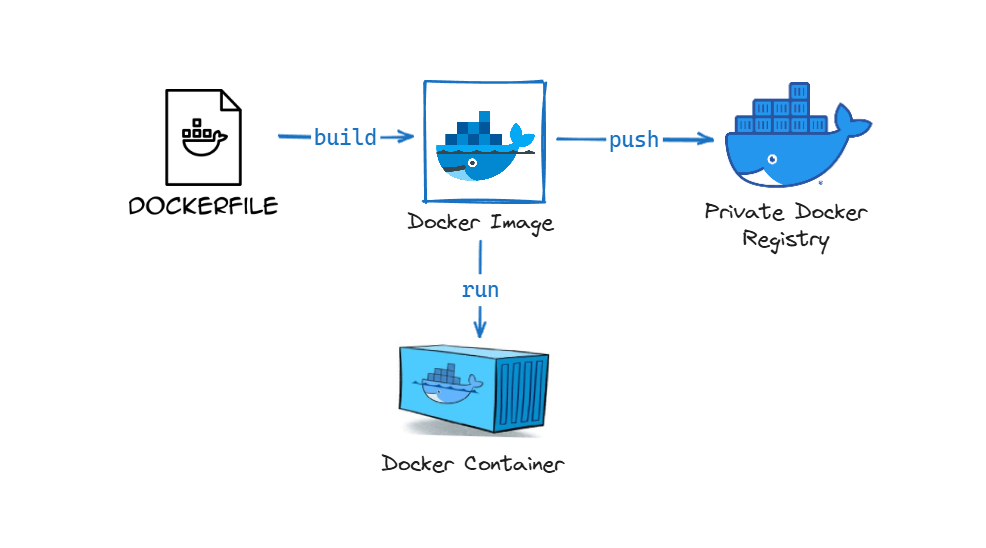
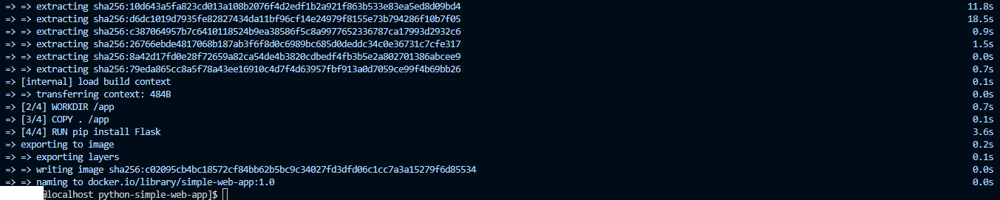
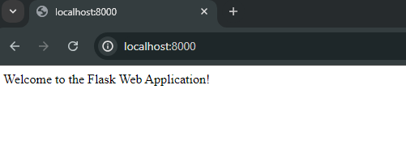

# Simple Python Web Application Using Dockerfile 🔭



This guide walks you through creating a Dockerized Python web application. You'll learn how to create a Dockerfile for a simple Python web app, build a Docker images/image, run a container, verify the app's functionality via a web browser, and push the Docker images/image to a private registry.

## What You'll Learn: 🧪

+ **Creating a Dockerfile:** Write a Dockerfile for a Python web application.

+ **Building the Docker images/image:** Build the Docker images/image from the Dockerfile.

+ **Running the Docker Container:** Start the container and run the application.

+ **Verifying the Application:** Access the application in a web browser to verify it's working.

+ **Pushing to a Private Registry:** Push the Docker images/image to a private Docker registry.

## Prerequisites: 🎀

## **A:** — Docker Engine 

For installation of Docker please refer to the official page.

https://docs.docker.com/engine/install/ubuntu/

### **B:** — Private Docker Registry

Private Docker Registry Configuration: https://github.com/ELemenoppee/devops-config-install/blob/main/docker/private-docker-registry.md

## Steps:- 🎉

### Step 1 — Create a New Directory

Begin by creating a new directory for your Python web application, which will house your application code and Dockerfile.

```bash
$ mkdir python-simple-web-app
$ cd python-simple-web-app
```

### Step 2  — Write Your Python Web Application Code

Create a file named `app.py` in the new directory. This file will contain your Python web application code. Here's an example of a basic Flask application:


```bash
$ vi app.py
```

Add the following inside the app.py file:

```bash
from flask import Flask, render_template

app = Flask(__name__)

@app.route('/')
def home():
    return "Welcome to the Flask Web Application!"

@app.route('/about')
def about():
    return "This is the about page."

if __name__ == '__main__':
    app.run(debug=True)
```

additional files:

```bash
$ vi requirements
```

Additionally, create a `requirements.txt` file listing the necessary dependencies:

Add the following content to `requirements.txt`:

```bash
Flask==2.0.1
Werkzeug==2.0.1
```

### Step 3 — Create a Dockerfile

In the same directory, create a Dockerfile to define the image build process:

```bash
$ vi Dockerfile
```

Add the following content to Dockerfile:

```bash
# Use an official Python runtime as a parent images/image
FROM python:3.9-slim

# Set the working directory in the container
WORKDIR /app

# Copy the current directory contents into the container at /app
COPY . /app

# Install any needed packages specified in requirements.txt
RUN pip install --no-cache-dir -r requirements.txt

# Make port 5000 available to the world outside this container
EXPOSE 5000

# Define environment variable
ENV FLASK_APP=app.py

# Run app.py when the container launches
CMD ["flask", "run", "--host=0.0.0.0"]
```

### Step 4 — Build the Docker Image

Navigate to the directory containing your `Dockerfile` and application code. Run the following command to build your Docker image:

```bash
$ docker build -t <images/image_NAME>:<TAG> .
```

for example:
```bash
$ docker build -t simple-web-app:1.0 .
```

You should see output indicating that the image is being built:



### Step 4 — Run the Docker Container

Once the image is built, you can run a container using the following command:

```bash
$ docker run -d -p <HOST_PORT:CONTAINER_PORT> <DOCKER_images/image_NAME>
```

for example:

```bash
$ docker run -d -p 8000:5000 simple-web-app:1.0
```

### Step 5 — Verify the Application

Open a web browser and navigate to http://localhost:8000 to see your Python web application in action.



### Step 6 — Push the Image to a Private Registry

Before pushing the image to your private Docker registry, tag it with your registry username and repository name. Replace <username> with your private Docker registry username and <repository> with your desired repository name:

```bash
$ docker tag simple-web-app:1.0 server-ip:5000/simple-web-app:1.0
```

Then, push the tagged image to your private Docker registry:

```bash
$ docker push server-ip:5000/simple-web-app:1.0
```

## Final Note

If you find this repository useful for learning, please give it a star on GitHub. Thank you!

**Authored by:** [ELemenoppee](https://github.com/ELemenoppee)