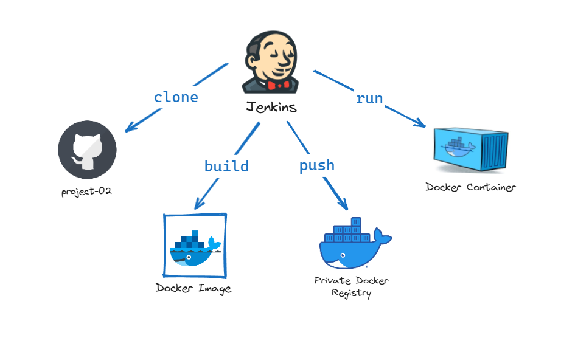
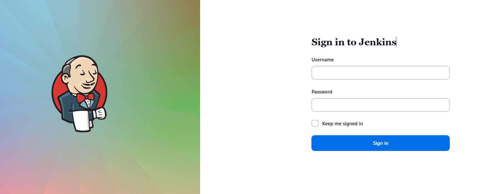
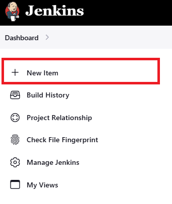
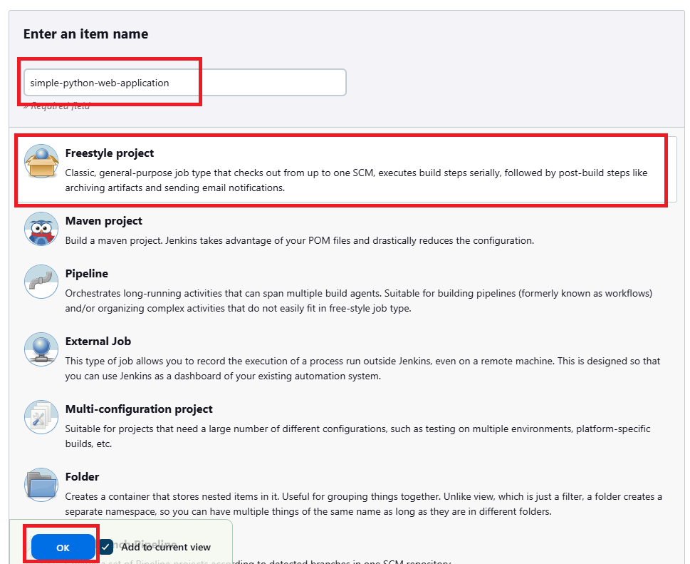
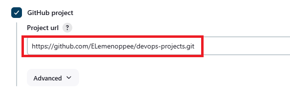
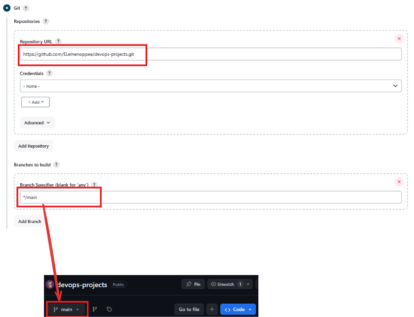
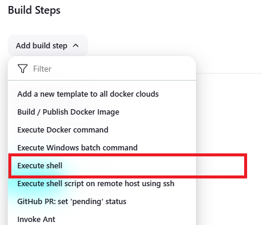
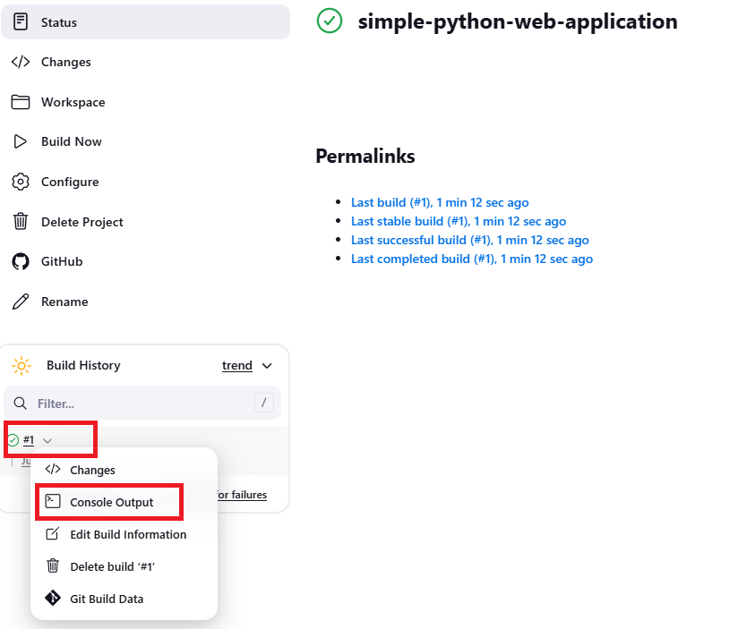
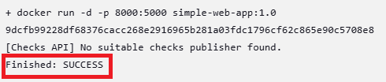
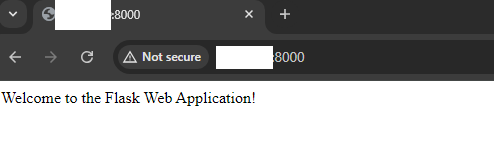

# Deploy Simple Python Web Application using Jenkins Freestyle Project



This guide provides a step-by-step procedure to deploy a simple Python web application using Jenkins Freestyle Project. The application, referred to as "project-02," will be built and deployed through Jenkins, automating the process of pulling code, building the Docker images/image, running the container, and verifying the deployment.

##  Prerequisites:

+ Jenkins Installed: Jenkins set up and running on your server.

+ Docker Installed: Docker installed on the Jenkins server.

+ Source Code Repository: The source code for "project-02" available in a Git repository.

+ Credentials: Necessary credentials for accessing the repository and Docker registry.

## Steps:

### Step 1 — Set Up Jenkins Freestyle Project

Open and log in to your Jenkins server.



Click "New Item."



Enter a name like "simple-python-web-application," select "Freestyle Project," and click "OK."



Check the "GitHub project" option and paste the project URL:  https://github.com/ELemenoppee/devops-projects



In the Source Code Management section, select "Git" and paste the repository URL: https://github.com/ELemenoppee/devops-projects.git. Ensure the Git branch matches the one on Jenkins; edit if necessary.



Under "Build Steps," click "Add build steps" and select "Execute shell."



Enter the following commands and click "Save":

```bash
echo "code build..."
cd project-02/python-simple-web-app
docker build -t simple-web-app:1.0 .

echo "code run..."
docker run -d -p 8000:5000 simple-web-app:1.0
```

To test the setup, click "Build Now."

Wait for the build to complete. To verify the success of the build, click the build number on the left side of the screen and then "Console Output."



Scroll down to the bottom of the screen and check for a "Finished: SUCCESS" status.



To view the deployed application, open a web browser and navigate to: http://jenkins-server-ip-address:8000



## Final Note

If you find this repository useful for learning, please give it a star on GitHub. Thank you!

**Authored by:** [ELemenoppee](https://github.com/ELemenoppee)