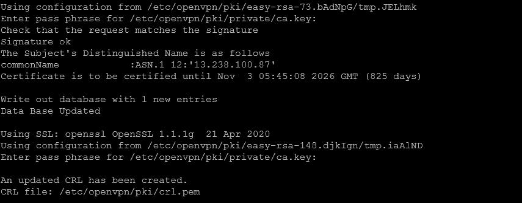

# OpenVPN on Docker


This guide provides detailed instructions on installing and configuring OpenVPN within a Docker container. OpenVPN is a popular open-source VPN solution that allows for secure and private connections over the internet.

## Prerequisites :-

**Docker Installed**: Esure Docker is installed on your machine.
n
## Steps :-

### **Step 1** — Create Data Volume

First, create an environment variable to store the volume name:

```
OVPN_DATA="ovpn"
```

Then, use the following command to create the Docker volume:

```
docker volume create --name $OVPN_DATA
```

### **Step 2** — Set Up the OpenVPN Container

With the data volume created, run the following command to initiate the OpenVPN container using the `kylemanna/openvpn` Docker image:

```
docker run -v $OVPN_DATA:/etc/openvpn --log-driver=none --rm kylemanna/openvpn ovpn_genconfig -u udp://<DOCKER-SERVER-IP-ADDRESS>
```

This command pulls the necessary data and configurations, generating the config file.

### **Step 3** — Set up Certificates

Next, generate a client certificate for connecting to the VPN network. Start the certificate setup process with the following command:

```
docker run -v $OVPN_DATA:/etc/openvpn --log-driver=none --rm -it kylemanna/openvpn ovpn_initpki
```

You will be prompted to enter a secure passphrase. The system will then generate an RSA private key.

You will also need to provide a name for the user, host, or server, which will be used to generate the certificate. This process may take some time, depending on your system's performance.



The output confirms the successful creation of the certificate.

### **Step 4** — Start the OpenVPN Container

Start the OpenVPN container using port 1194, which is the default UDP port for OpenVPN:

```
docker run -v $OVPN_DATA:/etc/openvpn -d -p 1194:1194/udp --cap-add=NET_ADMIN kylemanna/openvpn
```

Sample Output:

```
root@localhost:~# docker run -v $OVPN_DATA:/etc/openvpn -d -p 1194:1194/udp --cap-add=NET_ADMIN kylemanna/openvpn
ba4a4ee58ed89e3d94833526207da9ee7629ef7cfb85d8b1d98d80cee65df13f
```

### **Step 5** — Generate a Client Certificate

A client certificate is necessary for a client machine to connect to the OpenVPN server. Generate it with the following command, replacing [client-name] with the name of the client:


```
docker run -v $OVPN_DATA:/etc/openvpn --log-driver=none --rm -it kylemanna/openvpn easyrsa build-client-full [client-name] nopass
```

Sample Output:

```
root@localhost:~# docker run -v $OVPN_DATA:/etc/openvpn --log-driver=none --rm -it kylemanna/openvpn easyrsa build-client-full client1 nopass
Using SSL: openssl OpenSSL 1.1.1g  21 Apr 2020
Generating a RSA private key
.............+++++
..................................................+++++
writing new private key to '/etc/openvpn/pki/easy-rsa-1.OgNPGP/tmp.aOiCco'
-----
Using configuration from /etc/openvpn/pki/easy-rsa-1.OgNPGP/tmp.cCFjIE
Enter pass phrase for /etc/openvpn/pki/private/ca.key:
Check that the request matches the signature
Signature ok
The Subject's Distinguished Name is as follows
commonName            :ASN.1 12:'client1'
Certificate is to be certified until Nov  3 05:49:09 2026 GMT (825 days)

Write out database with 1 new entries
Data Base Updated
```

Enter the CA passphrase when prompted and wait for the certificate generation to complete.

### **Step 6** — Compile OpenVPN Configuration File

To compile the client configuration file, use the generated client certificate with the following command:

```
docker run -v $OVPN_DATA:/etc/openvpn --log-driver=none --rm kylemanna/openvpn ovpn_getclient [client-name]> [file-name].ovpn
```

Replace [client-name] with the client name used during certificate generation and [file-name] with your chosen file name, typically the client name.

### **Step 6** — Firewall Configuration

To allow OpenVPN traffic, configure your Docker server's firewall with these commands:

```bash
$ sudo ufw allow 1194/udp
$ sudo ufw allow OpenSSH
```

## Final Note

If you find this repository useful for learning, please give it a star on GitHub. Thank you!

**Authored by:** [ELemenoppee](https://github.com/ELemenoppee)