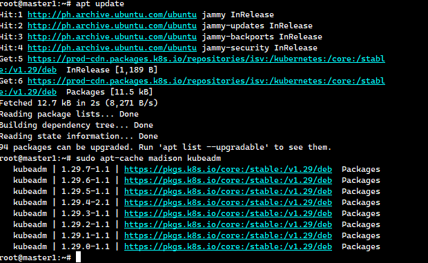
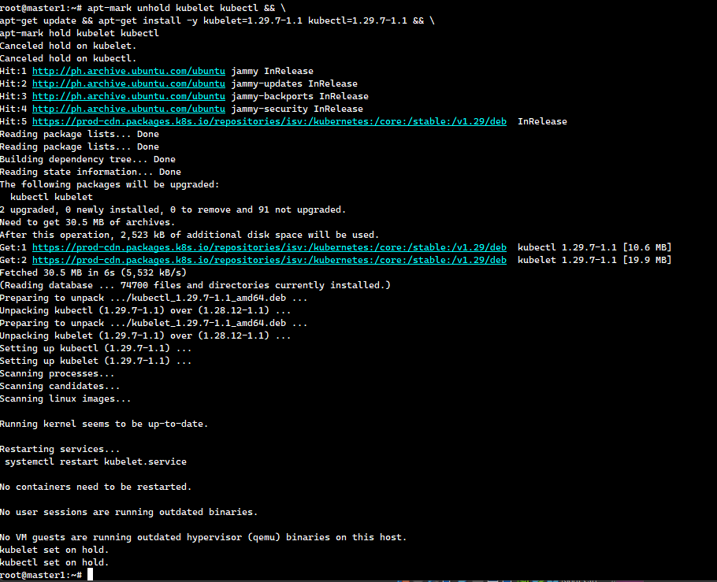
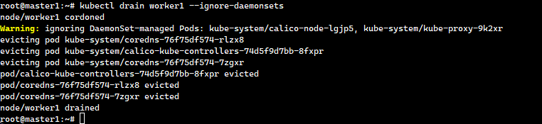
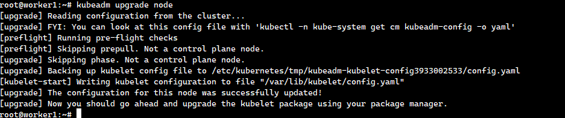

# Upgrading a Kubernetes Cluster

This guide details the steps involved in upgrading a Kubernetes cluster, ensuring minimal downtime and maintaining the stability of your applications. It covers the preparation, execution, and post-upgrade verification processes.

## Prerequisites :-

**Backup Configurations:** Ensure that all cluster configurations and data are backed up.

**kubectl Installed:** Confirm that kubectl is installed and correctly configured to interact with your cluster.

**Release Notes:** Thoroughly review the release notes for the Kubernetes version you are upgrading to.

## Upgrading kubeadm Clusters :-

This section provides a detailed process for upgrading a Kubernetes cluster created with kubeadm from version 1.28.x to 1.29.x, or from 1.29.x to 1.29.y (where y > x). Note that skipping minor versions during the upgrade is not supported.

The high-level workflow for the upgrade is as follows:

1. Upgrade the primary control plane node.
2. Upgrade additional control plane nodes.
3. Upgrade worker nodes.

## Upgrade Master Node :-

Log in to the Master Node server.

Add the Kubernetes apt repository. To specify a version different from v1.29, replace v1.29 with your desired minor version in the command below:

```bash
echo 'deb [signed-by=/etc/apt/keyrings/kubernetes-apt-keyring.gpg] https://pkgs.k8s.io/core:/stable:/v1.29/deb/ /' | sudo tee /etc/apt/sources.list.d/kubernetes.list
```

**Note:** This command will overwrite any existing configuration in /etc/apt/sources.list.d/kubernetes.list.

Sample Output:

```bash
root@master1:~# echo 'deb [signed-by=/etc/apt/keyrings/kubernetes-apt-keyring.gpg] https://pkgs.k8s.io/core:/stable:/v1.29/deb/ /' | sudo tee /etc/apt/sources.list.d/kubernetes.list
deb [signed-by=/etc/apt/keyrings/kubernetes-apt-keyring.gpg] https://pkgs.k8s.io/core:/stable:/v1.29/deb/ /
```

Find the latest patch release for Kubernetes 1.29 using your OS package manager:

```bash
apt update
apt-cache madison kubeadm
```

**Note:** Identify the latest version in the list. It will appear as 1.29.x-*, where x is the latest patch.

Sample Output:



On the control plane node, execute:

```bash
kubeadm upgrade plan
```

Sample Output:


Upgrade the kubeadm tool:

```bash
apt-mark unhold kubeadm && \
apt-get update && apt-get install -y kubeadm=1.29.7-1.1 && \
apt-mark hold kubeadm
```

Sample Output:


Verify the download and version:

```bash
kubeadm version
```

Sample Output:


Get the <_Node-Name_>:

```bash
kubectl get nodes
```

Sample Output: 


Drain the control plane node:

```bash
kubectl drain <Node-Name> --ignore-daemonsets --delete-local-data
```

Replace <_Node-Name_> with your control plane node's name.

Sample Output: 


On the control plane node, run:

```bash
kubeadm upgrade plan
```

Sample Output:


Apply the upgrade:

```bash
kubeadm upgrade apply v1.29.7
```

Sample Output:


Uncordon the control plane node:

```bash
kubectl uncordon <Node-Name>
```

Sample Output:


Upgrade kubelet and kubectl:

```bash
apt-mark unhold kubelet kubectl && \
apt-get update && apt-get install -y kubelet=1.29.7-1.1 kubectl=1.29.7-1.1 && \
apt-mark hold kubelet kubectl
```

Sample Output:



Restart kubelet:

```bash
systemctl daemon-reload
systemctl restart kubelet
```

Check the version:

```bash
kubectl get nodes
```

Sample Output:


## Upgrade Worker Node :-

Check the version of the worker node from the master machine:

```bash
kubectl get nodes
```

Sample Output:


On the worker machine, upgrade kubeadm:

```bash
apt-mark unhold kubeadm && \
apt-get update && apt-get install -y kubeadm=1.29.7-1.1 && \
apt-mark hold kubeadm
```

Sample Output:


Drain the worker node (execute this on the master machine):

```bash
kubectl drain <node-to-drain> --ignore-daemonsets
```

Sample Output:



Upgrade the kubelet configuration on the worker node (perform this on the worker machine):

```bash
kubeadm upgrade node
```

Sample Output:



Upgrade kubelet and kubectl (perform this on the worker machine):

```bash
apt-mark unhold kubelet kubectl && \
apt-get update && apt-get install -y kubelet=1.29.7-1.1 kubectl=1.29.7-1.1 && \
apt-mark hold kubelet kubectl
```

Sample Output:


Restart kubelet:

```bash
systemctl daemon-reload
systemctl restart kubelet
```

Uncordon the node (execute this on the master machine):

```bash
kubectl uncordon <Node-Name>
```

Sample Output:


Verify the cluster status:

```bash
kubectl get nodes
```

Sample Output:

