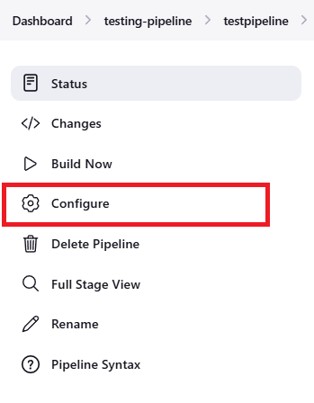

# Jenkins Notification to Microsoft Teams 👽

## Introduction ✍️

This guide explains how to set up Jenkins to send build notifications to a Microsoft Teams channel. Integrating Jenkins with Microsoft Teams allows you to receive real-time updates on your CI/CD pipeline, improving collaboration and keeping your team informed of build statuses.

## Prerequisites 👀

+ Jenkins Installed: A Jenkins server with administrative access.

+ Microsoft Teams: Access to a Microsoft Teams channel where you want to receive notifications.

## Steps 🪖

Create a Team: Set up a new team in Microsoft Teams. Choose an appropriate name for the team and decide whether it will be public or private based on your needs.

Manage the Channel: After creating the team, locate it in the left panel. Click the three-dot menu next to the team name, then select "Manage channel."

Configure Settings: Go to "Settings," then "Connectors," and click "Edit."

Add the Incoming Webhook: Select "Incoming webhook" and "Jenkins" from the available options, click "Add," and then "Configure."

Set Up the Webhook: Enter a name for the Jenkins connection.

Save the Webhook URL: Copy the webhook URL provided and save it to your clipboard.

Log In to Jenkins: Access your Jenkins server.

Manage Plugins: Navigate to "Manage Jenkins."

Install the Office 365 Connector Plugin: Under "System Configuration," select "Plugins." Search for "Office 365 Connector" and install it.

Configure the Project: Go to the specific Jenkins project you want to configure and click on the "Configure" button.

Set Up Notifications: Find the Office 365 Connector section, paste the webhook URL you copied earlier into the "URL" box, select the events for which you want notifications, and then click "Save."

Trigger a Build: Click the "Build Now" button to start a build.

Receive Notifications: As soon as the build starts, notifications will be sent to the specified Teams channel. You will also receive notifications once the build is complete.

## Final Note

If you find this repository useful for learning, please give it a star on GitHub. Thank you!

**Authored by:** [ELemenoppee](https://github.com/ELemenoppee)