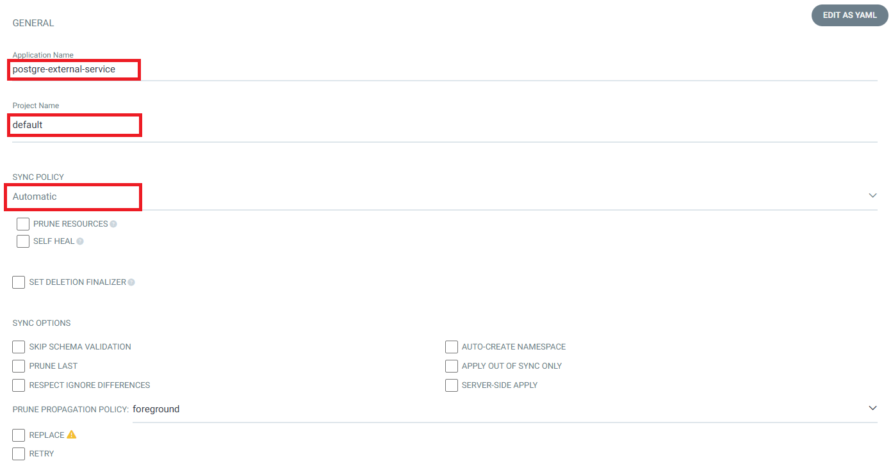

# Deploying PostgreSQL as an External Service in Kubernetes to Connect to AWS RDS PostgreSQL

## Description

This guide describes how to deploy a PostgreSQL service in a Kubernetes cluster that connects to an external AWS RDS PostgreSQL instance. This setup is useful for integrating external databases with applications running within Kubernetes while leveraging the managed database features of AWS RDS.

## Prerequisites

+ AWS RDS PostgreSQL Instance: An existing and running AWS RDS PostgreSQL instance.
+ Kubernetes Cluster: A running Kubernetes cluster with kubectl configured.
+ Database Credentials: Username and password for your RDS PostgreSQL database.

## Steps :-

Access the ArgoCD server.

Click on the "NEW APP" button to start adding a new application.

General: Enter the application name and project name. Set the sync policy to "Automatic" to enable automatic synchronization.

Source: Provide the repository URL and the path where your application's configuration files are stored.

Designation: Enter the cluster URL and the namespace where the application should be deployed.

Click on the "Create" button to finalize the process.

Once completed, you should see "postgre-external-service" listed.

