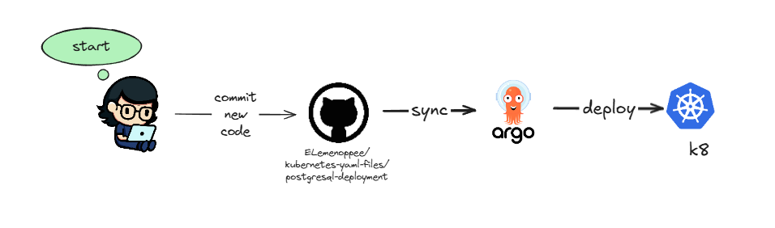
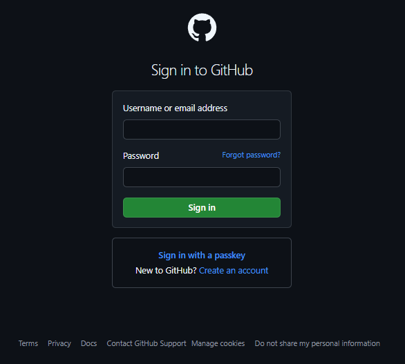
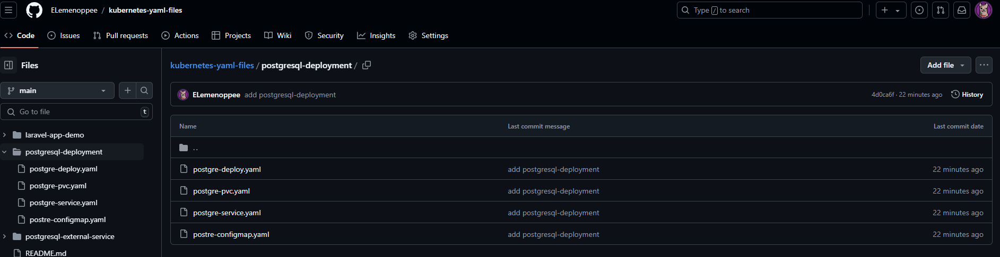
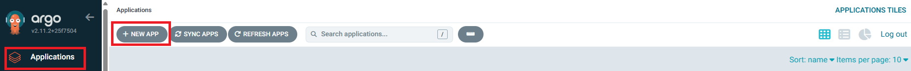
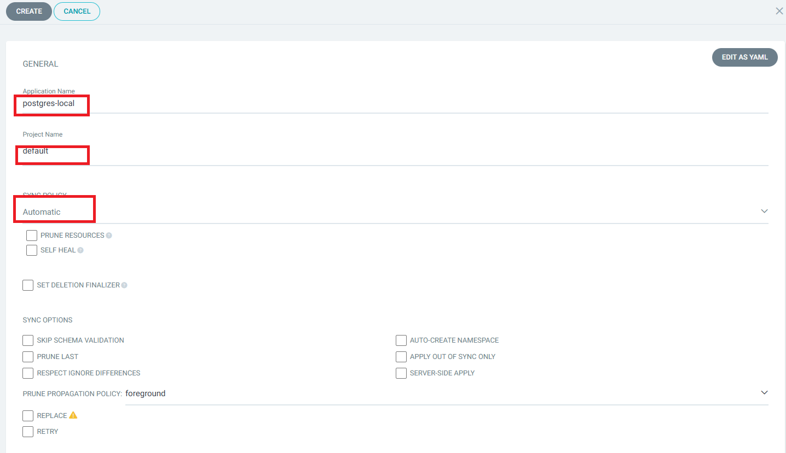
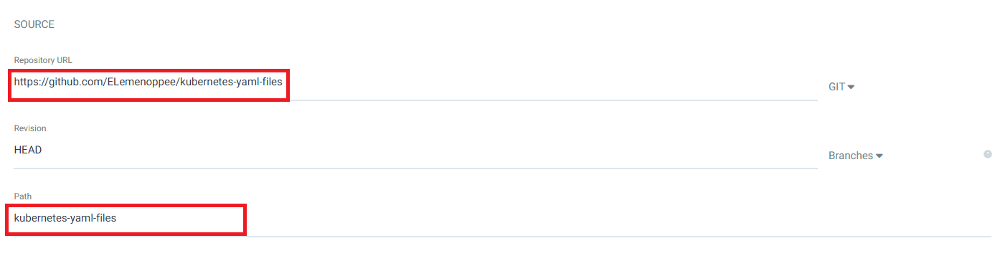
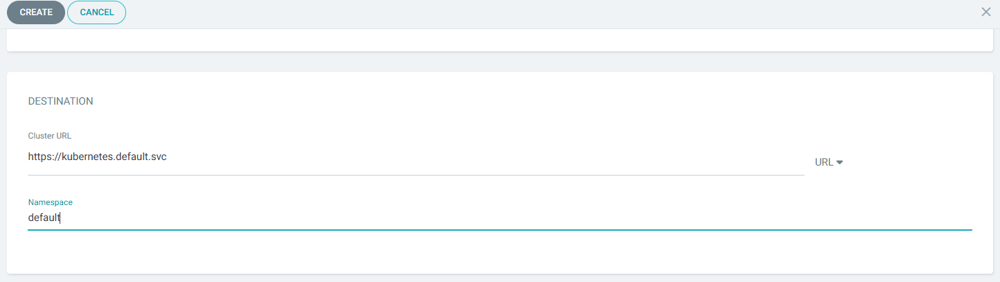

#  Deploying PostgreSQL with ArgoCD



## Description

This guide provides step-by-step instructions on deploying a PostgreSQL database using ArgoCD in a Kubernetes environment. ArgoCD is a GitOps continuous delivery tool that enables easy management and deployment of applications.

## Steps :-

### Prepare the PostgreSQL YAML Files
To deploy PostgreSQL, you will need to create three YAML configuration files:

PostgreSQL Deployment YAML (postgresql-deploy.yaml)
This file defines the deployment configuration for the PostgreSQL database:

```bash
apiVersion: apps/v1
kind: Deployment
metadata:
  name: postgres-local
spec:
  replicas: 1
  selector:
    matchLabels:
      app: postgres
  template:
    metadata:
      labels:
        app: postgres
    spec:
      containers:
        - name: postgres
          # images/image: 'postgres:15.3-alpine3.17'
          images/image: 'postgres:14.9-alpine3.17'
          images/imagePullPolicy: IfNotPresent
          ports:
            - containerPort: 5432
          envFrom:
            - configMapRef:
                name: postgres-secret
          volumeMounts:
            - mountPath: /var/lib/postgresql/data
              name: postgres
      volumes:
      - name: postgres
        persistentVolumeClaim:
          claimName: postgres
```

Persistent Volume Claim YAML (postgresql-pvc.yaml)
This file requests storage resources for PostgreSQL:

```bash
apiVersion: v1
kind: PersistentVolumeClaim
metadata:
  name: postgres
spec:
  accessModes:
    - ReadWriteOnce
  resources:
    requests:
      storage: 5Gi
  storageClassName: local-path
```

Service YAML (postgresql-svc.yaml)
This file exposes the PostgreSQL service to other applications and allows external access:

```bash
apiVersion: v1
kind: Service
metadata:
  name: postgres
  labels:
    app: postgres
spec:
  type: NodePort
  ports:
    - port: 5432
  selector:
    app: postgres
```

### Add the PostgreSQL YAML Files to the Repository

Access your GitHub account.



Clone the repository where you will store your YAML files:

```bash
git clone https://github.com/ELemenoppee/kubernetes-yaml-files
```

Navigate to the cloned repository and create a new directory for the PostgreSQL YAML files:

```bash
cd kubernetes-yaml-files/
mkdir postgresql-deployment
cp -pf postgresql-deploy.yaml postgresql-deployment/
cp -pf postgresql-pvc.yaml postgresql-deployment/
cp -pf postgresql-svc.yaml postgresql-deployment/
```

Use the following commands to add, commit, and push your changes to the repository:

```bash
git add *
git commit -m 'add kubernetes-yaml-files'
git push
```

Check the repository to ensure the YAML files have been successfully added:



### Deploy the Database Using ArgoCD

Access your ArgoCD server interface.


On the left side of the screen, click on "Applications," then click on "New App."



In the General settings, enter the application name, project name, and set the sync policy to "Automatic."



Under Source, provide the Repository URL and specify the path to your PostgreSQL YAML files.



In the Destination section, set the Cluster URL and Namespace, then click the "Create" button to finalize the application setup.



By following these steps, you will successfully deploy a PostgreSQL database using ArgoCD in your Kubernetes environment.