# Deploying Ansible on AWS EC2 using Terraform

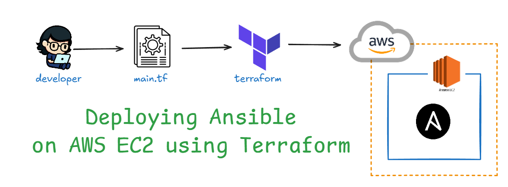

## Purpose

The primary purpose of this mini project is to provide a practical hands-on experience in using Terraform to deploy Ansible on an AWS EC2 instance. This setup will help you understand how to provision infrastructure as code (IaC) while preparing a server environment where you can later execute Ansible playbooks to manage configurations and automate tasks.

## Objectives:

### Understand Terraform Basics:

Gain practical knowledge of Terraform syntax and its workflow for provisioning infrastructure.

### Utilize Input and Output Variables:

Learn how to define and use input variables to customize the deployment of resources (such as AWS region and instance type).

Implement output variables to display useful information (like the public IP of the deployed EC2 instance).

### Work with Terraform Modules:

Develop modular code by creating reusable modules for deploying AWS resources.
Enhance code organization and maintainability by encapsulating the Ansible setup within a separate module.

### Deploy Ansible:

Set up Ansible on an Amazon EC2 instance using user data scripts to automate installation and configuration.

## Task List for Deploying Ansible on AWS EC2 using Terraform

1. **Set Up Project Structure**
   - Create a directory named `terraform-mini-project`.
   - Inside the directory, create the following files and folders:
     - `main.tf`
     - `modules/`
       - Inside `ec2-module/`, create:
         - `main.tf`
         - `variables.tf`
         - `outputs.tf`
     - `provider.tf`

        Output: 

        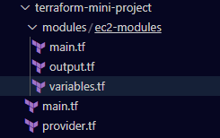

2. **Configure the AWS Provider** (provider.tf)
   - Add the AWS provider configuration to specify the region for deployment.

        Output:

        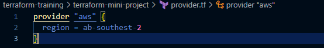

3. **Define Input Variables** (ec2-module/variables.tf)
   - Create input variables for AWS region, instance type, and key pair name.

        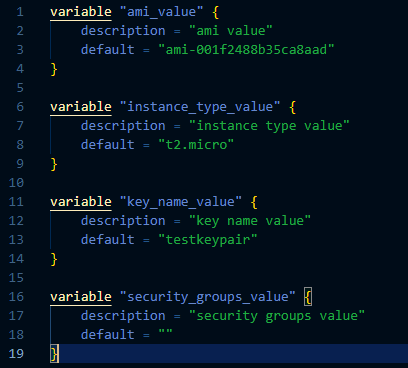

4. **Create EC2 Module** (ec2-module/main.tf)
   - Define an EC2 instance resource that installs Ansible using user data.
   - Ensure the instance is set up to allow SSH access.

        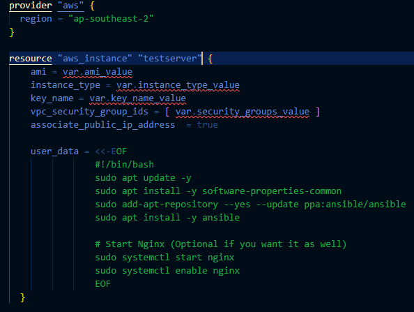

6. **Set Up Module Outputs** (ec2-module/outputs.tf)
   - Specify output variables to capture and display the instance ID and public IP address of the deployed EC2 instance.

        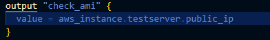

7. **Call the EC2 Module** (main.tf)
   - Invoke the EC2 module and pass the required input variables.

        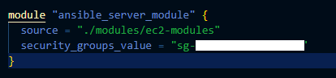

9. **Initialize Terraform**
   - Run `terraform init` in the project directory to initialize the Terraform configuration.

        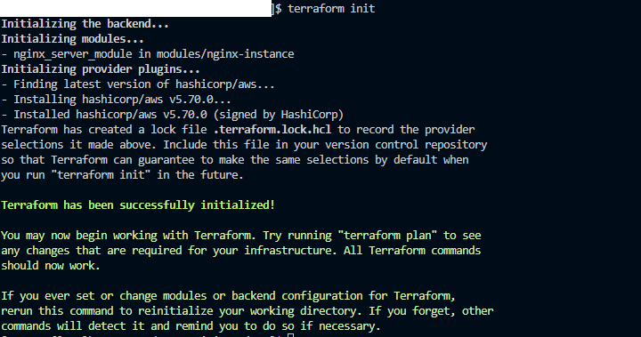

10. **Review the Execution Plan**
    - Execute `terraform plan` to review the resources that will be created.

        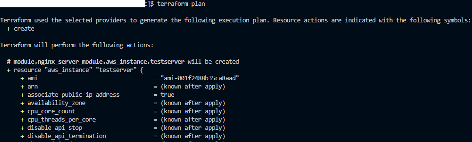

11. **Apply the Configuration**
    - Use `terraform apply` to deploy the EC2 instance with Ansible installed.

        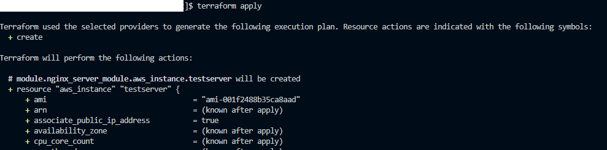

12. **Verify Deployment**
    - SSH into the EC2 instance using the provided key pair and verify that Ansible is installed.

        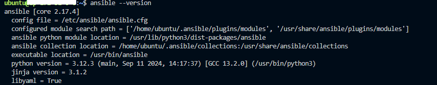

14. **Clean Up Resources**
    - Once done, run `terraform destroy` to remove the deployed resources and avoid incurring additional costs.

        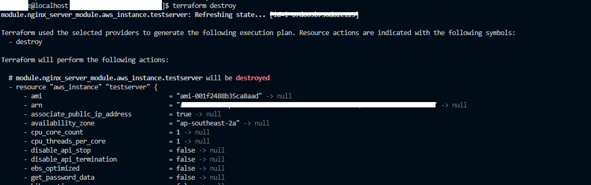
