# Terraform Project: Deploying EC2 Instance with HashiCorp Vault using Terraform

## Project Description
The primary purpose of this mini project is to provide practical hands-on experience in using Terraform to deploy an EC2 instance that runs **HashiCorp Vault**. This setup will help you understand how to provision infrastructure as code (IaC) while managing secrets securely.

## Objectives
1. **Understand Terraform Basics**: Gain practical knowledge of Terraform syntax and its workflow for provisioning infrastructure.
2. **Utilize Input and Output Variables**: Define and use input variables to customize the deployment and implement output variables to display useful information.
3. **Work with Terraform Modules**: Create reusable modules for deploying AWS resources to enhance code organization and maintainability.
4. **Deploy HashiCorp Vault**: Set up Vault on an Amazon EC2 instance using user data scripts for automated installation and configuration.
5. **Implement Security Groups**: Configure security groups to allow necessary access for Vault and SSH.
6. **Apply Infrastructure as Code (IaC) Principles**: Write code to define and provision infrastructure, promoting consistency and repeatability.
7. **Develop Cloud Skills**: Build foundational skills in cloud computing and AWS resource management, essential for cloud engineering or DevOps roles.

## Task List
1. **Set Up Project Structure**
   - Create a directory named `terraform-ec2-vault`.
   - Inside the directory, create the following files and folders:
     - `main.tf`
     - `variables.tf`
     - `outputs.tf`
     - `provider.tf`
     - `modules/`
       - Inside `modules/`, create:
         - `security-group/`
           - Inside `ec2-security-group/`, create:
             - `main.tf`
             - `variables.tf`
             - `outputs.tf`
         - `ec2-instance/`
           - Inside `ec2-with-hashicorp-vault/`, create:
             - `main.tf`
             - `variables.tf`
             - `outputs.tf`

    Result:

    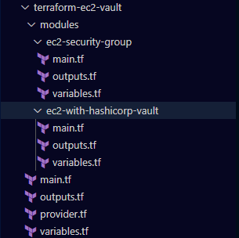

2. **Configure the AWS Provider** (provider.tf)
   - Add the AWS provider configuration to specify the region for deployment.

   Result:

   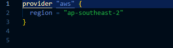

3. **Define Input Variables** (variables.tf)
   - Create input variables for instance type, AMI ID, and key pair name.

   Result:

   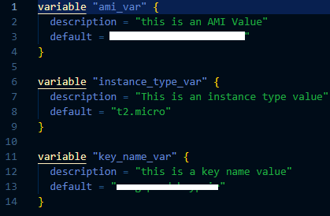

4. **Create Security Group Module** (modules/ec2-security-group/main.tf)
   - Define a security group that allows HTTP (port 8200) and SSH (port 22) access.

    Result:

    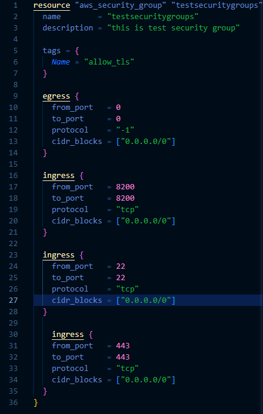

5. **Set Up Security Group Outputs** (modules/ec2-security-group/outputs.tf)
   - Specify output variables to capture and display the security group ID.

   Result:

   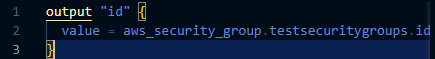

6. **Create EC2 Instance Module** (modules/ec2-with-hashicorp-vault/main.tf)
   - Define an EC2 instance resource that installs HashiCorp Vault using user data.

   Result:

   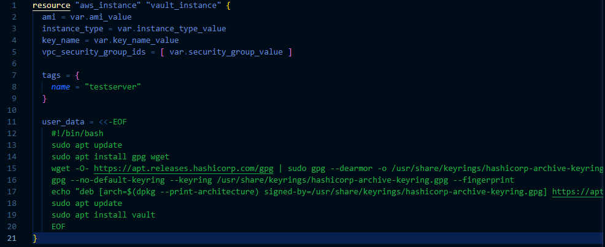

7. **Configure EC2 Instance Module Variables** (modules/ec2-with-hashicorp-vault/variables.tf)
   - Define variables needed for the EC2 instance, such as instance type, AMI ID, key name, and security group ID.

   Result:

   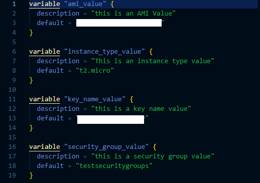

8. **Set Up EC2 Instance Outputs** (modules/ec2-with-hashicorp-vault/outputs.tf)
   - Specify output variables to capture and display the public IP address of the deployed EC2 instance.

   Result:

   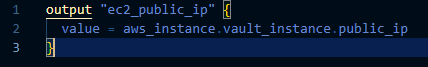

9. **Call the Modules** (main.tf)
    - Invoke the security group and EC2 instance modules and pass the required input variables.

    Result:

    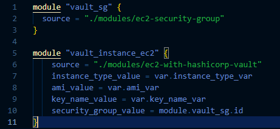

11. **Define Output Variables** (outputs.tf)
    - Create output variables in the main configuration to display the public IP and security group ID.

    Result:

    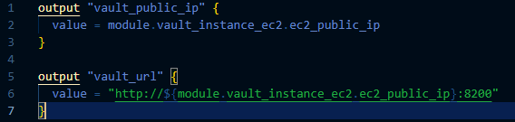

12. **Initialize Terraform**
    - Run `terraform init` in the project directory to initialize the Terraform configuration.

    Result:

    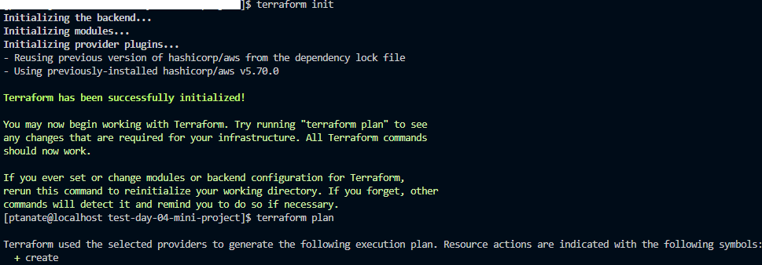

13. **Review the Execution Plan**
    - Execute `terraform plan` to review the resources that will be created.

    Result:

    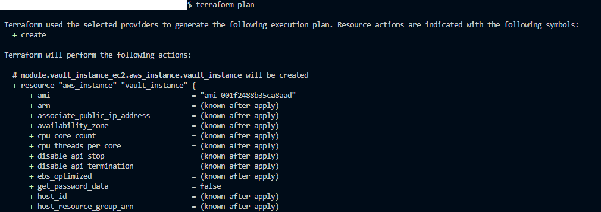

14. **Apply the Configuration**
    - Use `terraform apply` to deploy the EC2 instance with HashiCorp Vault installed.

    Result:

    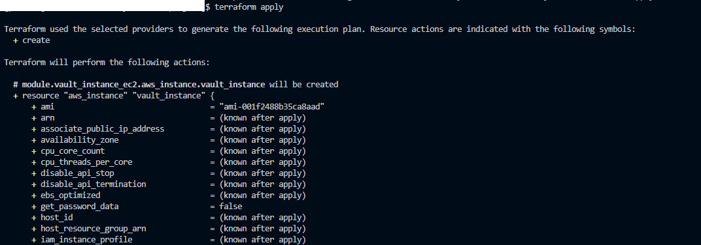

17. **Clean Up Resources**
    - Once done, run `terraform destroy` to remove the deployed resources and avoid incurring additional costs.

    Result:

    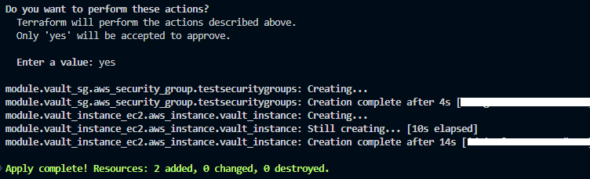

