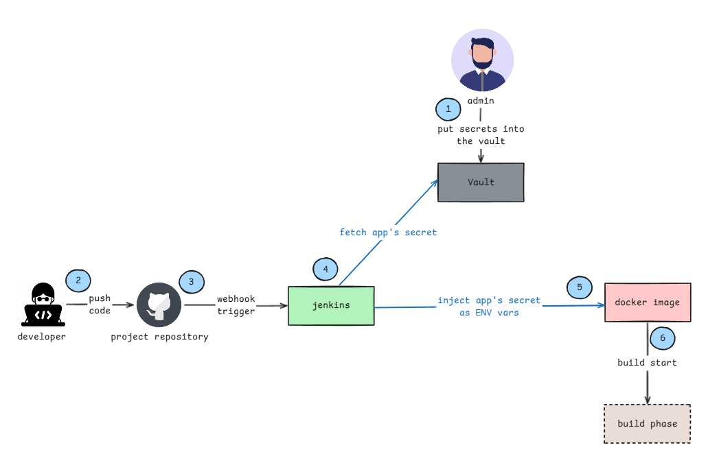

# Configuring HashiCorp Vault with Jenkins



## Workflow

1.	`Secrets Management`: Authorized users securely store application secrets in HashiCorp Vault.
2.	`Code Push`: Developers push code changes to the repository.
3.	`Webhook Trigger`: A webhook triggers the Jenkins pipeline to start on code push.
4.	`Secret Retrieval`: As the pipeline starts, Jenkins fetches the required application secrets from Vault.
5.	`Secret Injection`: Jenkins reads the secrets, injects them into an .env file, and incorporates them into the Docker image.
6.	`Build Phase`: The application build phase begins with all required secrets securely included.

## Description 

This guide provides a step-by-step process to set up and configure HashiCorp Vault for managing and securely storing secrets, tokens, and other sensitive data.

## Prerequisites

+ Vault Installed: Ensure that HashiCorp Vault is installed on your system. You can download it from HashiCorp’s website.

Note: If you want to install HashiCorp Vault using Terraform, please refer to the detailed guide available here: https://github.com/ELemenoppee/devops-projects/tree/main/project-10.

## Steps :-

### 1. Set Up Vault Directories

Log in to your Vault server and create directories for configuration, data, and logs.

```bash
sudo mkdir /etc/vault
sudo mkdir /vault-data
sudo mkdir -p /logs/vault/
```

### 2. Configure Vault

Create a config.json file and add the Vault configuration settings.

```bash
sudo vi /etc/vault/config.json
```

Add the following JSON configuration. Vault supports both JSON and HCL formats; this guide uses JSON.

*Note:* Replace 127.0.0.1 with your Vault server's public or private IP address.

```bash
{
"listener": [{
"tcp": {
"address" : "0.0.0.0:8200",
"tls_disable" : 1
}
}],
"api_addr": "http://127.0.0.1:8200",
"storage": {
    "file": {
    "path" : "/vault-data"
    }
 },
"max_lease_ttl": "10h",
"default_lease_ttl": "10h",
"ui":true
}
```

### 3. Create a Vault Service File

Define the service file for Vault.

```bash
vi /etc/systemd/system/vault.service
```

Add the following configuration:

```bash
[Unit]
Description=vault service
Requires=network-online.target
After=network-online.target
ConditionFileNotEmpty=/etc/vault/config.json

[Service]
EnvironmentFile=-/etc/sysconfig/vault
Environment=GOMAXPROCS=2
Restart=on-failure
ExecStart=/usr/bin/vault server -config=/etc/vault/config.json
StandardOutput=/logs/vault/output.log
StandardError=/logs/vault/error.log
LimitMEMLOCK=infinity
ExecReload=/bin/kill -HUP $MAINPID
KillSignal=SIGTERM

[Install]
WantedBy=multi-user.target
```

### 4. Start and Enable Vault Service

Start the Vault service and enable it to run on system startup.

```bash
sudo systemctl start vault.service
sudo systemctl enable vault.service
```

### 5. Set Vault Environment Variable

Log in as root and export the `VAULT_ADDR` environment variable. Add this to `~/.bashrc` for persistence. Update the IP address to your Vault server's IP.

```bash
export VAULT_ADDR=http://127.0.0.1:8200
echo "export VAULT_ADDR=http://127.0.0.1:8200" >> ~/.bashrc
```

### 6. Initialize and Unseal Vault

Initialize Vault and capture the root token and unseal keys.

```bash
vault operator init > /etc/vault/init.file
cat /etc/vault/init.file
```

The output will contain keys like this:

```bash
Unseal Key 1: jsQ6ZshBCowoddwDhHTy7DgJU9To8YAprYToqPkMUrNg
Unseal Key 2: 9PWznYV+uM+a1o6rMEGcuINeCtGnMRiV1a5xTe6EerSd
Unseal Key 3: mavIFllXbQmo7QE2qmLuH9HfYEPQMLpCZNgT0QoRUkcE
Unseal Key 4: VzXhuvnNuZkld4LnhPEjNyTEMJR3qIkq/UsinwWWdv5l
Unseal Key 5: ho23N6R2WGPOpijGsCMElv/z4u9OxMw9AbEEMbePySU7

Initial Root Token: d4dd0b96-4767-57a3-9081-aca03e530c8f

Vault initialized with 5 key shares and a key threshold of 3. Please securely
distribute the key shares printed above. When the Vault is re-sealed,
restarted, or stopped, you must supply at least 3 of these keys to unseal it
before it can start servicing requests.

Vault does not store the generated master key. Without at least 3 key to
reconstruct the master key, Vault will remain permanently sealed!

It is possible to generate new unseal keys, provided you have a quorum of
existing unseal keys shares. See "vault operator rekey" for more information.
```

Note: Vault remains unsealed until it is re-sealed or restarted. Use at least three unseal keys to unlock Vault when needed.

### 7. Log In and Access the Vault UI

Log in with your root token:

```bash
vault login
```

You can now access the Vault UI at http://<IP_ADDRESS>:8200/ui.

### 8. Configure Vault Role for Jenkins

Define a role with permissions for Jenkins. Under the Vault console, run the following command to set up an AppRole with unlimited token usage.

```bash
vault write auth/approle/role/jenkins token_num_uses=0 secret_id_num_uses=0 secret_id_ttl=0 token_ttl=0 token_max_ttl=0 policies="jenkins"
```

Retrieve the Role ID and Secret ID:

```bash
vault read auth/approle/role/jenkins/role-id
vault write -f auth/approle/role/jenkins/secret-id
```

### 9. Install and Configure the Vault Plugin in Jenkins

Log in to your Jenkins server.

Go to `Manage Jenkins` > `Plugins` > `Available plugins`, search for "`HashiCorp Vault`" and install it.

Navigate to `Manage Credentials` and add `Vault AppRole Credentials`. Use the Role ID and Secret ID obtained above.

### 10. Configure Vault Integration in Jenkins

In Jenkins, fill out:

- Vault URL (e.g., http://<IP_ADDRESS>:8200)

- Vault Credential (e.g., vault-jenkins-role)

- Optionally, disable SSL if not using SSL certificates for Vault in your setup.

### 11. Set Up Access Policy for Jenkins

Define a policy to allow Jenkins to read secrets.

Create `jenkins-policy.hcl`:

```bash
path "/auth/token/create" {
  capabilities = ["update"]
}

path "secret/test" {
  capabilities = [ "read", "list" ]
}
```

Apply the policy:

```bash
vault policy write jenkins jenkins-policy.hcl
```

### 12. Create a Declarative Jenkins Pipeline

Add a Jenkins pipeline to use Vault secrets.

```bash
pipeline {

    agent any

    stages {
        stage('Clean Workspace') {
            steps {
                cleanWs()
            }
        }
        stage('Prebuild Stage') {
            steps {
                script {
                    // Define Vault secrets and their corresponding environment variables
                    def secrets = [
                        [path: 'secret/test', engineVersion: 1, secretValues: [
                            [envVar: 'secret', vaultKey: 'secret'],
                            [envVar: 'SECRET01', vaultKey: 'SECRET01']]],
                    ]

                    // Vault configuration settings (URL, credentials, etc.)
                    def configuration = [
                        vaultUrl: 'http://127.0.0.1:8200/',
                        vaultCredentialId: 'vault-jenkins-role',
                        engineVersion: 1
                    ]

                    // Fetch secrets and set them to environment variables
                    withVault([configuration: configuration, vaultSecrets: secrets]) {
                        sh 'touch .env'
                        sh 'echo "secret=$secret" > .env'
                        sh 'echo "SECRET01=$SECRET01" >> .env'
                    }
                }
            }
        }
    }
}
```

### Final Verification

Run the pipeline in Jenkins to confirm that secrets are fetched and used as environment variables.
