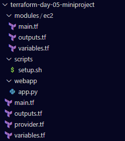
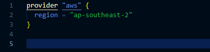
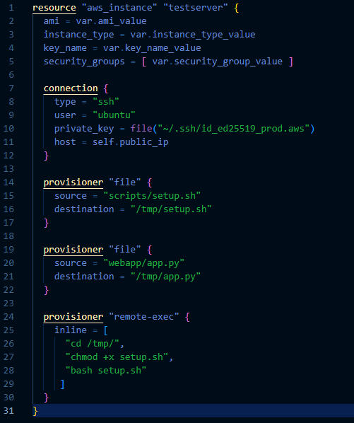
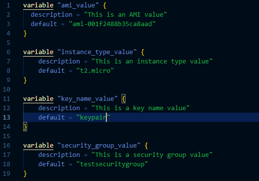
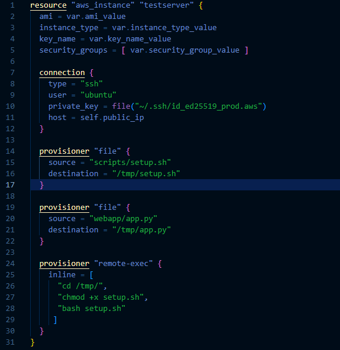
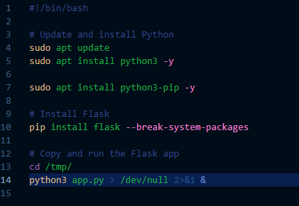
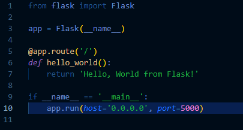
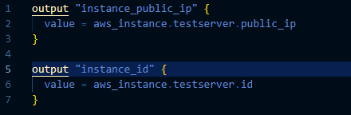
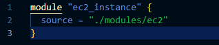
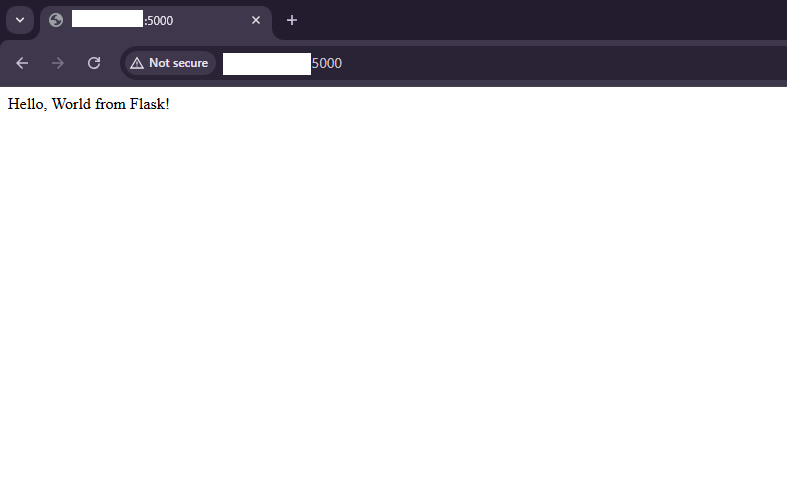

# Terraform Project: Deploying a Python Web Application on AWS EC2 with Terraform

## Project Description
This mini-project focuses on deploying an AWS EC2 instance using Terraform to install and run a simple Python web application. You’ll use input and output variables, modules, and provisioners (file and remote-exec) to automate copying files to the instance and configuring it to run the Python web application.

## Objectives
- **Create an EC2 Instance**: Use Terraform to provision an AWS EC2 instance.
- **Utilize Input and Output Variables**: Define input variables to customize deployment and output variables to display useful information.
- **Use Terraform Modules**: Create reusable modules to organize your code.
- **Use Provisioners**: Implement file and remote-exec provisioners to copy files and execute scripts on the EC2 instance.
- **Deploy a Python Web Application**: Set up a simple Python web application and ensure it runs on the EC2 instance.

## Task List

### 1. Set Up Project Structure

- Create a directory named `terraform-python-webapp`.
- Inside the directory, create the following files and folders:
  - `main.tf`
  - `variables.tf`
  - `outputs.tf`
  - `provider.tf`
  - `modules/`
- Inside `modules/`, create:
  - `ec2/`
- Inside `ec2/`, create:
  - `main.tf`
  - `variables.tf`
  - `outputs.tf`

- Create a `scripts/` folder, which will contain a script to install the Python web application.

- Create a `webapp/` folder containing a simple Python web application (e.g., a Flask app).

Result:



### 2. Configure the AWS Provider (provider.tf)

- Configure the AWS provider with the region where you want to deploy the instance.

Result:



### 3. Create the EC2 Module (modules/ec2/main.tf)

- Define an EC2 instance with provisioners to install Python, copy the web app files, and start the application.



### 4. Create the EC2 Module Variables (modules/ec2/variables.tf)

- Define variables that the EC2 module will require.



### 5. Create the EC2 Module (modules/ec2/main.tf)

- Define an EC2 instance with provisioners to install Python, copy the web app files, and start the application.




### 6. Set Up the Python Web Application (scripts/setup.sh)

- In the scripts folder, create the setup.sh script to install Python, Flask, and run the web application.



### 7. Create the Flask Web Application (webapp/app.py)

- Inside the webapp folder, create a simple Python web app using Flask.



### 8. Define the Outputs (modules/ec2/outputs.tf)

- Capture and output the instance’s public IP and instance ID.



### 9. Call the EC2 Module (main.tf)

- Use the EC2 module in your main configuration.



### 10. Run the Project

- Initialize Terraform in the project directory:

```bash
terraform init
```

- Check the execution plan:

```bash
terraform plan
```

- Apply the configuration to deploy the EC2 instance and run the Python app:

```bash
terraform apply
```

### 11. Verify the Python Web App

Once Terraform completes the deployment, retrieve the EC2 instance’s public IP from the outputs.

Open your browser and go to http://<public-ip>:5000 to see the "Hello, World from Flask!" message.



### 12. Clean Up Resources

- After you're done, destroy the resources to avoid unnecessary costs:

```bash
terraform destroy

```