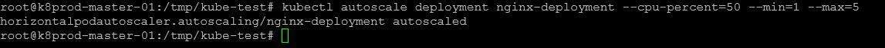

# Horizontal Pod Autoscaler

## Description

The Horizontal Pod Autoscaler (HPA) dynamically adjusts the number of pod replicas in a Kubernetes deployment based on observed resource utilization. This guide walks you through the process of configuring and testing an HPA in your Kubernetes environment.

## Steps :-

Step 1: Install the Metrics Server

The Metrics Server is essential for collecting resource usage metrics like CPU and memory from the Kubelet and exposing them via the Kubernetes API. If it’s not already installed, follow these instructions:

Download and apply the Metrics Server YAML file:

```bash
wget https://raw.githubusercontent.com/k21academyuk/Kubernetes/master/metrics-server.yaml
kubectl create -f metrics-server.yaml
```

Verify the installation: Check that the Metrics Server pod is running in the `kube-system` namespace:

```bash
kubectl get pods -n kube-system
```


You should see the Metrics Server pod in a running state.

Step 2: Deploy a Sample Application

We’ll use an Nginx deployment as the sample application to demonstrate autoscaling.

Create a deployment file (`nginx-deployment.yaml`) with the following configuration:

```bash
apiVersion: apps/v1
kind: Deployment
metadata:
  name: nginx-deployment # Name of the deployment
spec:
  replicas: 1 # Number of initial replicas (pods)
  selector:
    matchLabels:
      app: nginx # Label selector for the pods
  template:
    metadata:
      labels:
        app: nginx # Labels for the pods
    spec:
      containers:
      - name: nginx # Name of the container
        images/image: nginx:latest # Docker images/image to use for this container
        ports:
        - containerPort: 80 # Port to expose on the container
        resources:
          requests:
            cpu: "100m" # CPU request for the container
          limits:
            cpu: "200m" # CPU limit for the container
```

Apply the deployment:

```bash
kubectl apply -f nginx-deployment.yaml
```


Verify the deployment: Ensure the Nginx deployment is created and running:

```bash
kubectl get deployments
```


Confirm that the pod is active.

Step 3: Create a Horizontal Pod Autoscaler

With the Nginx deployment running, create an HPA to scale pods based on CPU utilization.

Set up the HPA: Use the following command to create an HPA for the `nginx-deployment`:

```bash
kubectl autoscale deployment nginx-deployment --cpu-percent=50 --min=1 --max=5
```

+ --cpu-percent=50: Target average CPU utilization.
+ --min=1: Minimum number of pods.
+ --max=5: Maximum number of pods.



Verify the HPA: Check the HPA configuration and status:

```bash
kubectl get hpa
```


The HPA should now be monitoring the `nginx-deployment`.

Step 4: Simulate Load to Trigger Autoscaling

To observe HPA scaling behavior, simulate a CPU load on the Nginx pods.

Deploy a load generator: Run a temporary busybox pod to simulate requests:

```bash
kubectl run -it --rm load-generator --images/image=busybox /bin/sh
```

Generate CPU load: Inside the busybox pod, execute an infinite loop that continuously sends HTTP requests to the Nginx service:

```bash
while true; do wget -q -O- http://10.244.17.121; done
```

Replace `10.244.17.121` with the internal IP address of your Nginx pod if necessary.


Monitor autoscaling: Observe the scaling behavior by checking the HPA and the number of pods:

```bash
kubectl get hpa
kubectl get pods
```

As the CPU utilization rises, the HPA will increase the number of Nginx pods to handle the load.

## Conclusion

By following these steps, you’ve successfully configured and tested a Horizontal Pod Autoscaler in Kubernetes. The HPA ensures your application can dynamically adjust its capacity based on real-time resource demands, optimizing performance and resource utilization.
