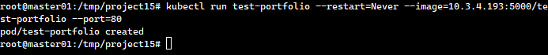

# Deploying a Docker Application to Kubernetes

Deploying applications in Kubernetes requires a structured process to ensure that Docker images are properly stored, accessible, and deployed within the cluster. In this guide, I will walk you through how I pushed a Docker image to a private registry and deployed it in Kubernetes.

This article is a continuation of my previous post on Deploying a Static Website with Docker, where I shared how to containerize and serve a static website. Now, I’m taking it a step further by deploying a Dockerized application in Kubernetes!

## Step 1: Logging in to the Private Docker Registry

Before pushing my image, I first authenticated with my private Docker registry using the following command:

```sh
docker login -uadmin <docker_registry_ip_address>:5000
```

Example output:


## Step 2: Tagging the Docker Image

To push the image to the registry, I tagged it with the registry’s IP address and port:

```sh
docker tag test-portfolio <docker_registry_ip_address>:5000/test-portfolio
```

Example output:


## Step 3: Pushing the Image to the Private Registry

After tagging, I pushed the image to my private registry:

```sh
docker push <docker_registry_ip_address>:5000/test-portfolio
```

Example output:


## Step 4: Verifying the Image in the Registry

To confirm that the image was stored successfully, I ran a container using the newly tagged image:

```sh
docker run -ti -p 8080:80 <docker_registry_ip_address>:5000/test-portfolio
```

At this stage, the image was now available in the private registry and could be accessed by anyone with the appropriate permissions.

## Step 5: Deploying the Application in Kubernetes

Next, I deployed the application in Kubernetes by creating a pod using the image from my private registry:

```sh
kubectl run test-portfolio --restart=Never --image=<docker_registry_ip_address>:5000/test-portfolio --port=80
```

Example output:



To confirm the pod was running, I checked the list of pods:

```sh
kubect get pods
```

Example output:


Step 6: Exposing the Application

To make the application accessible, I exposed it as a service:

```sh
kubectl expose pods test-portfolio --type=NodePort --port=80
```

To verify that the service was successfully created, I listed all services:

```sh
kubectl get services
```

Example output:


## Step 7: Accessing the Application in the Browser

Finally, I found the external port assigned to the application and opened it in a web browser to verify that it was accessible.


## Conclusion

By following these steps, I successfully pushed a Docker image to a private registry and deployed it in a Kubernetes cluster. This setup ensures that my application is properly managed, scalable, and accessible within the infrastructure.

If you enjoyed this guide, make sure to check out my previous post on Deploying a Static Website with Docker and stay tuned for more DevOps insights! 🚀

Don’t forget to clap and share if you found this helpful! 😊